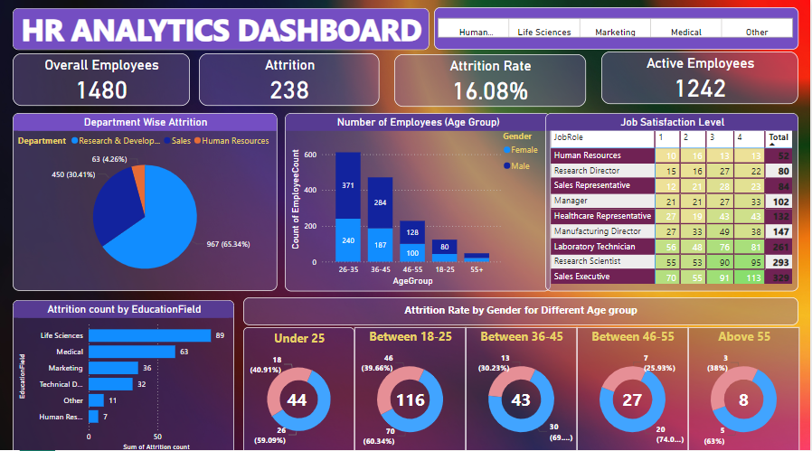

# HR Analytics: A Complete Employee Data Analysis Project using Power Bi Dashboard

## About the Project
This HR analytics Tableau project is aimed at providing HR managers and business leaders a comprehensive way to analyze and monitor employee data, and make data-driven decisions related to employee retention, development, and recruitment.

This includes trendlines and target lines to help HR managers track progress toward reducing attrition. It has charts showing the distribution of employees and attrition rate by gender, age group, job satisfaction, and education field. The charts include legends and interactive filters to allow HR managers to drill down and explore the data further.

## Technologies Used
- **Advanced Excel** 👨‍💻
- **Power BI** 📊
- **Statistics** 📜

## Steps Overview
1. Data subset collected from online.
2. Understanding the Data.
3. Loading Libraries.
4. Data Cleaning & Finding Missing values.
5. Data Visualization.

## Data Cleaning
1. Open Dataset in Excel and Make a Copy of Dataset for security purposes.
2. Remove Duplicates.
3. Change the formatting of necessary columns.
4. Spell Check.
5. Change Case - Lower/Upper/Proper.
6. Trim the unwanted spaces.
7. Remove null values if it's not going to affect the result.
8. Find & Replace.

## Results
Here is a visualization of the analysis results:

For an interactive version, check out [this link]([https://example.com/interactive-visualization](https://github.com/sahilverma96/HR-Analytics-Dashboard-Power-Bi-/blob/main/HR_Visual.PNG)).

## Download the Power BI Dashboard
You can download the Tableau dashboard used in this project by clicking the link below:

[Download hr_analytics_dashboard.pbit](hr_analytics_dashboard.pbit)

## Contributing
Feel free to open issues or submit pull requests.

## License
This project is licensed under the MIT License.
